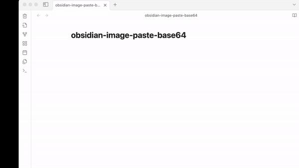

# Obsidian Image Base64 Plugin

> **Warning:**
> - This plugin manages all base64 image files through a single JSON file. As the JSON file grows, it may impact the speed of image retrieval. Please consider this before using.
> - This project is developed for personal use. The method of managing base64 images may change at any time, so please use it with caution.

## Why I Made This

This plugin was developed for personal use but is available for anyone who finds it useful. The primary goal of the `obsidian-image-base64` plugin is to facilitate the management of images in Obsidian notes by converting and storing them as base64 encoded strings.

## How to Use

### Adding Images

1. Copy an image to your clipboard or drag and drop it into Obsidian.
2. Use the `Paste Image as Base64` or `Drag and Drop` feature to convert the image into a base64 format.
3. The plugin automatically saves the base64 data along with a unique ID into a designated JSON file within a specified folder.

### Embedding Images in Markdown

To embed a base64 image in your markdown notes, add a code block with the following format:

\`\`\`image-base64  
name: pasted-image-1706693871338  
id: f53c0e92-75d2-4986-8435-a33bff2af5d6  
\`\`\`  

This code block will be automatically replaced with the corresponding base64 image stored in the JSON file.

### Example Usage

<!-- get image ./img.gif -->

## Ribbon and Command Usage

You can easily manage unused base64 images by using the Ribbon and Command features to find and delete them, keeping your notes clean and efficient.
